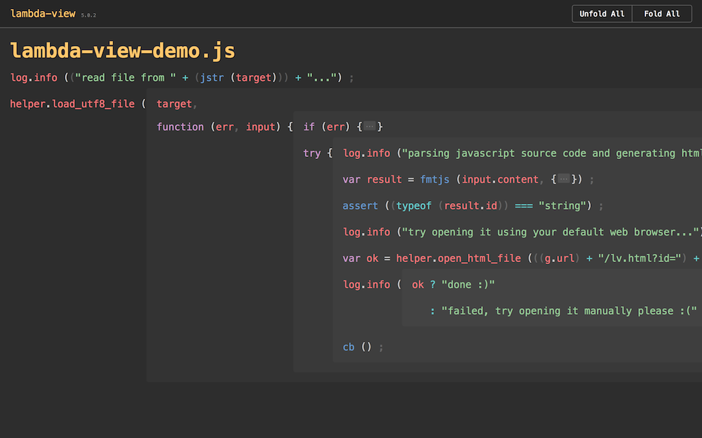

# lambda-view: A New Tool for Reading JavaScript Code

lambda-view provids you a better way to READ JavaScript source code. 

# Screenshots



# Get started in 2 steps

STEP-1 install it via npm (sudo required maybe):

```
npm install -g lambda-view
```

STEP-2 use lv command to open any JavaScript file:

```
lv target.js
```

Then (if everything is ok), your web browser will be opened automatically and shows you the result. Pretty easy, right? 

# Helpful tips

### Can I open remote file by URL?

Yes, lv command accepts URL:

```
lv https://code.jquery.com/jquery-3.1.1.js
```

### Can I open multiple files in one command?

Yes, you can provide multiple filenames to lv command:

```
lv file1.js file2.js file3.js
```

Further more, you can use the wildcard (For Linux/Mac only, Not Windows):

```
lv *.js
```

### Can I use lambda-view on my iphone/ipad?

Yes. 

This is an experimental feature. 

lambda-view embeded a small web server which accepts local access only by default. However you can reconfigure it to accept public access. This makes your computer become a web server that can be accessed by your iphone/ipad. 

You can achieve it in 3 steps.

STEP-1 stop current lambda-view web server:

```
lv-svr stop
```

STEP-2 start lambda-view web server with public mode:

```
lv-svr start --public --background
```

STEP-3 open any JavaScript file you want to read on your iphone/ipad:

```
lv some-file.js
```

Now, the web browser will be opened, and you can copy it's URL to your iphone/ipad's safari. Then you can read it. (Your iphone/ipad )

Please make sure:

* Your computer and your iphone/ipad must connected to the same LAN
* If there is any firewall enabled on your computer, please configure it to allow public access on TCP port 23400

# Future plans

This is just a begining. I'll add more features soon. 

